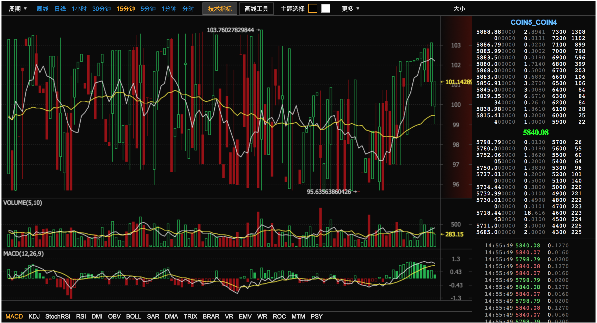
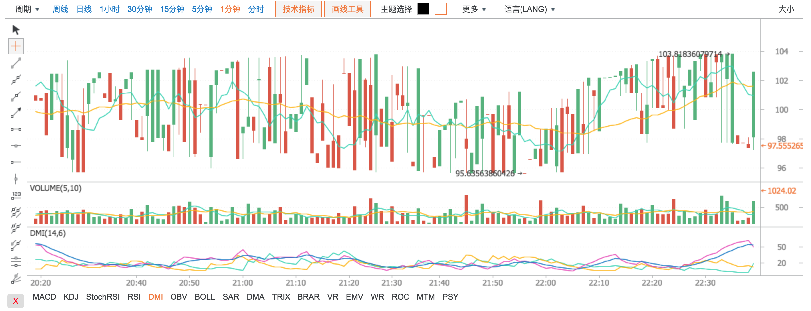

# Kline     [](https://badge.fury.io/js/kline)

<a href="http://www.wtfpl.net/"></a>

[](https://npmjs.org/package/kline)

> 本项目扒了某网站的K线插件做了一些封装和二次开发,使其更加便于使用和修改,方便后来的开发者. 修改主要涉及以下几个点:

* 使用 [webpack](https://webpack.js.org/) 打包 css/images/html
* 使用 ES6 + Babel 对原有代码进行了拆分和重构
* 删除了一些不必要的逻辑
* 把源码中可配置的部分抽出来
* 添加了对 websocket(stomp over websocket) 连接方式的支持
* 增加对外接口及事件回调

### Features

    ✅ 支持两种主题配色切换 
    ✅ 支持简体中文,英文,繁体中文三种语言 
    ✅ 可配置的时间聚合方式
    ✅ 支持多种画线工具
    ✅ 支持多种画图算法
    ✅ 支持深度图数据及最近成交数据展示
    ✅ 支持普通轮询和Websocket Over Stomp两种连接方式

### ScreenShot!





### Requirements

* jquery
* jquery.mousewheel
* sockjs (仅stomp方式需要)
* stomp (仅stomp方式需要)

### Install & Load

安装

```bash
$ npm install kline 
```

* 使用标签引入, 在HTML页面头部加入

```html
    <script src="/lib/sockjs.js"></script>
    <script src="/lib/stomp.js"></script>
    <script src="/lib/jquery.js"></script>
    <script src="/lib/jquery.mousewheel.js"></script>
    <script src="/dist/kline.js"></script>
```

* OR RequireJS

```javascript
    require.config({
        paths: {
            "jquery": "../lib/jquery",
            "jquery.mousewheel": "../lib/jquery.mousewheel",
            "sockjs": "../lib/sockjs",
            "stomp": "../lib/stomp",
            "kline": "../js/kline"
        },
        shim: {
            "jquery.mousewheel": {
                deps: ["jquery"]
            },
            "kline": {
                deps: ["jquery.mousewheel", "sockjs", "stomp"]
            }
        }
    });

    require(['kline'], function () {
       // ...
    });
```


* OR CommonJS

```javascript
    var Kline = require('kline');
```


* OR ES6

```javascript
    import Kline from 'kline';
```


* 在页面中加入

```html
  <div id="kline_container"></div>
```

### Examples

* Poll(轮询)

```javascript
    var kline = new Kline({
        element: "#kline_container",
        symbol: "BTC",
        symbolName: "比特币",
        type: "poll", // poll/stomp
        url: "http://127.0.0.1:8080/mock.json"
    });
    kline.draw();
```

* Stomp Over Websocket

```javascript
   var kline = new Kline({
        element: "#kline_container",
        symbol: "BTC",
        symbolName: "比特币",
        type: "stomp", // poll/stomp
        url: 'http://127.0.0.1:8088/socket',
        subscribePath: "/kline/subscribe",
        sendPath: "/kline/send"       
    });
    kline.draw();
```


### Support Options

| 参数名称   | 参数说明          |   默认值
|:---------|:-----------------|:------------
|`element` | 容器元素选择器     | #kline_container
|`width`   | 宽度 (px)         | 1200
|`height`   | 高度度 (px)      | 650
|`theme`   | 主题 dark(暗色)/light(亮色) | dark
|`language` | 语言 zh-cn(简体中文)/en-us(英文)/zh-tw(繁体中文) | zh-cn
|`ranges` | 聚合选项 1w/1d/12h/6h/4h/2h/1h/30m/15m/5m/3m/1m/line (w:周, d:天, h:小时, m:分钟, line:分时数据) | ["1w", "1d", "1h", "30m", "15m", "5m", "1m", "line"]
|`symbol` | 交易代号 | 
|`symbolName`  | 交易名称 | 
|`type`  | 连接类型 stomp/poll(轮询) |  poll
|`url`  | 请求地址 | 
|`limit`  | 分页大小 | 1000
|`intervalTime`  | 请求间隔时间(ms) | 3000
|`subscribePath`   | 订阅地址 (仅stomp方式需要) | 
|`sendPath`   | 发送地址 (仅stomp方式需要) | 
|`debug`   | 是否开启调试模式 true/false |  true
|`showTrade`   | 是否显示行情侧边栏 true/false |  true
|`enableSockjs`   | 是否开启sockjs支持 true/false |  true
|`reverseColor`   | 是否反色, 默认绿涨红跌 true/false | false
|`stompClient`   | stomp 连接对象 | null


### Methods

* draw()

    画K线图

```javascript
kline.draw();
```

* resize(int width, int height)

    设置画布大小

```javascript
kline.resize(1200, 550);
```

* setSymbol(string symbol, string symbolName)

    设置交易品种

```javascript
kline.setSymbol('usd/btc', 'USD/BTC');
```

* setTheme(string style)

    设置主题

```javascript
kline.setTheme('dark');  // dark/light
```

* setLanguage(string lang)

    设置语言

```javascript
kline.setLanguage('en-us');  // en-us/zh-ch/zh-tw
```

* setShowTrade: function (isShow) 

    设置展示是否展示交易模块

```javascript
kline.setShowTrade(false);  // true/false
```

* toggleTrade: function () 

    切换展示是否展示交易模块

```javascript
kline.toggleTrade(); 
```

* setIntervalTime: function (intervalTime) 

    设置请求间隔时间(ms)

```javascript
kline.setIntervalTime(5000); 
```

* connect: function () 

    建立socket连接

```javascript
kline.connect(); 
```

* disconnect: function () 

    断开socket连接

```javascript
kline.disconnect(); 
```

* pause: function () 

    暂停请求数据

```javascript
kline.pause(); 
```

* resend: function () 

    重新请求数据

```javascript
kline.resend(); 
```

### Events

| 事件函数                 |   说明
|:-----------------------|:------------
| `onResize: function(width, height)`   | 画布尺寸改变时触发
| `onLangChange: function(lang)`   | 语言改变时触发
| `onSymbolChange: function(symbol, symbolName)`   | 交易品种改变时触发
| `onThemeChange: function(theme)`   | 主题改变时触发
| `onRangeChange: function(range)`   | 聚合时间改变时触发


> Example

```javascript
    var kline = new Kline({
        element: "#kline_container",
        symbol: "BTC",
        symbolName: "比特币",
        type: "poll", // poll/stomp
        url: "http://127.0.0.1:8080/mock.json",
        onResize: function(width, height) {
            console.log("chart resized: " + width + " " + height);
        }
    });
```


### Response

> Example

```json
{
  "success": true,
  "data": {
    "lines": [
      [
        1.50790476E12,
        99.30597249871,
        99.30597249871,
        99.30597249871,
        99.30597249871,
        66.9905449283
      ]
    ],
    "trades": [
      {
        "amount": 0.02,
        "price": 5798.79,
        "tid": 373015085,
        "time": 1508136949000,
        "type": "buy"
      }
    ],
    "depths": {
      "asks": [
        [
          500654.27,
          0.5
        ]
      ],
      "bids": [
        [
          5798.79,
          0.013
        ]
      ]
    }
  }
}
```

* 响应参数说明:

* `lines`: K线图, 依次是: 时间(ms), 开盘价, 最高价, 最低价, 收盘价, 成交量
* `depths`(可选, 行情侧边栏显示): 深度图数据,  `asks`:一定比例的卖单列表, `bids`:一定比例的买单列表, 其中每项的值依次是 成交价, 成交量
* `trades`(可选, 行情侧边栏显示): 最近成交记录,  `amount`: 成交量, `price`:单价, `tid`:订单ID, `time`:成交时间(ms), `type`:成交类型 buy/sell
